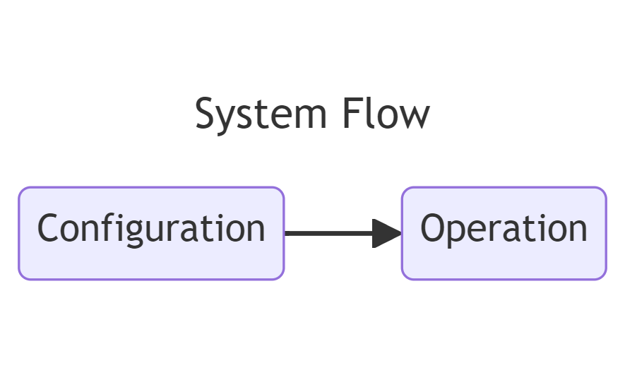
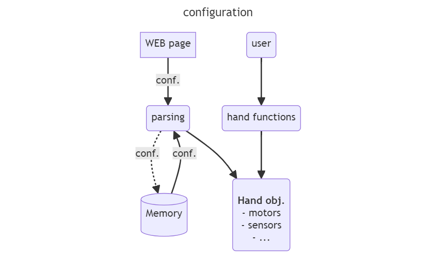
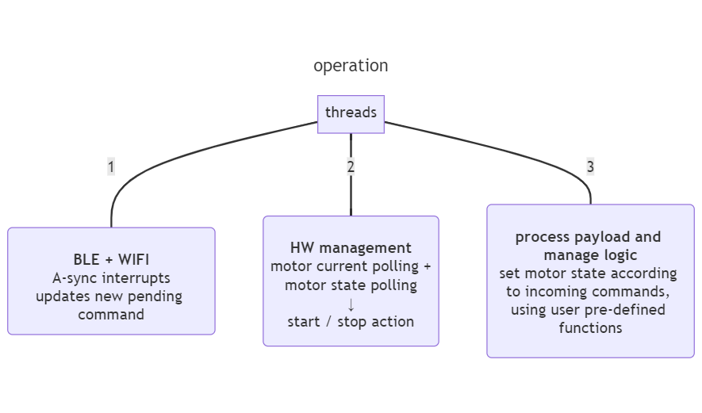
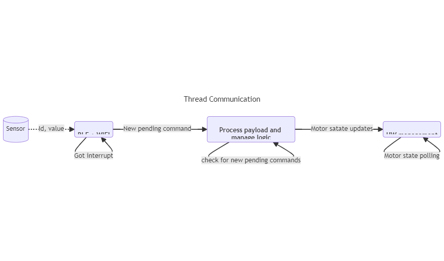
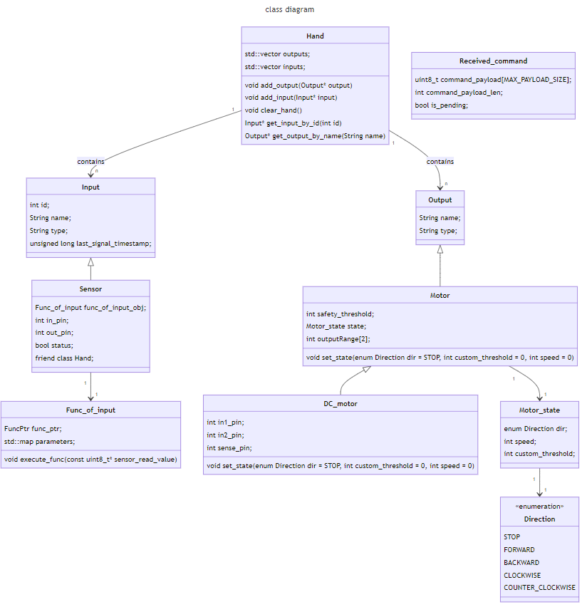
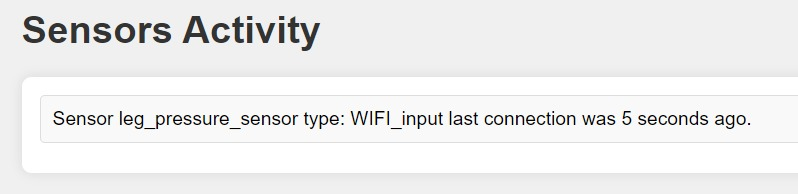
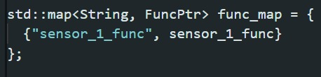
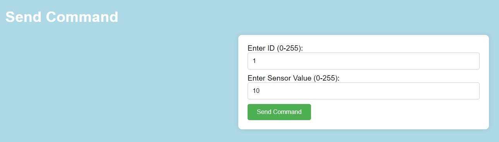
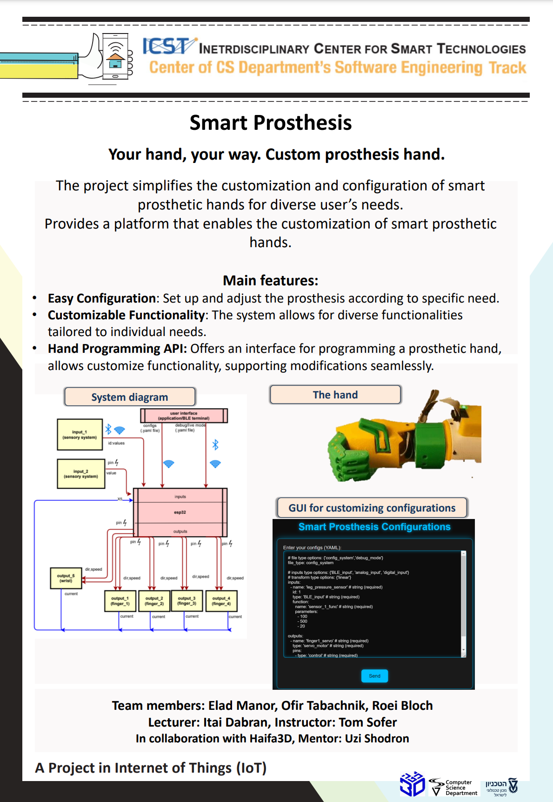

################
Smart Prosthesis
################

**The project simplifies the customization and configuration of smart 
prosthetic hands for diverse user’s needs. Provides a platform that enables 
the customization of smart prosthetic hands.**

.. contents:: **Table of Contents**
    :depth: 3

overview
########

System flow
===========

The flow can be divided into two main parts: configuration and operation.

Configuration
*************

The configuration of the hand consists of two main parts:

#. YAML file -
    The system either loads from memory or receives from the user a YAML file
    that specifies the system components. This allows for full flexibility in modifying the hand structure in the future.
    The YAML file also associates sensors with their target functionalities (see `functionality`_).

    After receiving a new configuration file from the user, it will be saved to memory and loaded
    the next time the controller is launched.

    Example for such YAML file:

    .. _YAML_FIGURE:
   
    .. figure:: ./images/YAML.jpeg
       :width: 30%

    .. _functionality:

#. Functionality - 
    Each sensor corresponds to a specific function that defines the desired behavior of 
    the hand based on the values sensed by the sensor.

    These functions are pre-written by the administrator and can be easily added or modified as needed.
    Each sensor's functionality should be specified in the YAML file.

**note** The configuration of the hand is a one-time operation and does not need to be repeated each time the hand is relaunched.

Operation
*********

After the hand is configured, the system operates with three main flows, managed by three threads:

#. BLE + WIFI listenner:
    This thread listens for asynchronous interrupts. once caught an interrupt - creates a new command object which allows the communication with the third thread.
    A new command is labeled with a "pending" flag to be executed by the third thread (described below). 
#. HW management:
    **This is the only thread that writes to and reads from HW.**

    Commands received from sensors are translated into basic motor actions and stored as the current "state." Each state has an "end condition" (i.e., the current
    value sensed by the motor). The HW Management thread iterates through all motors, checks their states, and directs the motors to start an action (with custom 
    direction and speed), stop an action, or make no change to their operation.
#. Process payload and manage logic:
    This thread is responsible for parsing payloads received from sensors and triggering the relevant hand functions. These functions update the motor states used 
    for communication with the HW Management thread, which controls the motors.

**note:** The threads communicate with shared resources, protected and synchronized with locks. 

Class Diagram
=============

Admin (user) Instructions
#########################

This section covers:
 #. Writing a New Configuration File (YAML): `YAML structure`_
 #. Sending a New Configuration (YAML) to the Hand: `sending configs`_
 #. Getting Data About Connected Sensors: `sensors activity`_

.. _YAML structure:

YAML sctucture
==============

The YAML file should start with a file type field set to config_system. The YAML consists of two main parts:
 #. Inputs (Sensors): Attributes include name, id, type, and function (the corresponding hand function pre-coded by the admin).
 #. Outputs (Motors): Attributes include name, type, and pins.
An example YAML file is provided in this repository under the name `config_system_usecase.yaml` (or see `YAML_FIGURE`_ above).

.. _sending configs:

Sending Configs
===============

When the hand (controller) is powered on, it acts as a Wi-Fi access point, creating a small LAN for communication. To send your YAML file:
  #. Connect to the hand's Wi-Fi network from your PC. Look for "smart_prosthesis" and enter the password: "100inIOT".
  #. Open a web browser and navigate to "192.168.4.1" (the default IP address of the controller).
  #. a text box will appear; paste your YAML file or modify the default configuration and click 'Send'.

.. _sensors activity:

Sensors Activity
================

Connect to the hand's Wi-Fi network as described above and access the page at 192.168.4.1/sensors_activity.

    

Developer Instructions
#######################

This section covers:
 #. Writing New Hand Functions: `write hand function`_
 #. `Sending Data Via Wi-Fi`_:
 #. `Sending Data Via BLE`_:

.. _write hand function:

Write A Hand Function
=====================

Hand functions are defined and implemented in ./main/hand_functions.ino.
The API for accessing hand elements (motors, sensors, etc.) can be found in ./main/classes.h.
Example for accessing a parameter defined in the YAML:

To access `param1: 100` (from the YAML file), use `params["param1"]` in your function. For more details, see the examples in `./main/hand_functions.ino`.
(For more info see the examples in './main/hand_functions.ino')

**note: After adding a new function, add it to the `func_map` defined in `./main/hand_functions.ino`.**

.. _Sending Data Via Wi-Fi:

Sending Data Via Wi-Fi
======================

There are 2 ways to send data via wifi:
  #. Regular client - wifi client that connects to the hand controller LAN, see wifi client example in './WIFI_client/WIFI_client.ino'
     **note** the controller expects to get the payload as a string, which the first byte is the sensor id, followed by the values. 
     we supply the function for converting the payload from uint8_t to string and sending it to the wifi server (controller) - 'send_sensor_values' 
     at './WIFI_client/WIFI_client.ino'.
  #. Web page - for easier **debug**, we support sending a simulated sensor values through a web page. Connect to the hand wifi and enter
     '192.168.4.1/send_command'

An image of the web page for sending commands:

.. _Sending Data Via BLE:

Sending Data Via BLE
====================

.. list-table:: 

    * - We support sending data via a BLE terminal (e.g., the BLE Scanner app). The device name for the BLE is 'smart_prosthesis'.
        The UUID for sending the payload is 'e0198002-7544-42c1-0001-b24344b6aa70'.

        **Note:** Due to BLE limitations, we currently support sending payloads up to 20 bytes.

      - .. figure:: ./images/BLE_app_1.jpeg
           :width: 100%

      - .. figure:: ./images/BLE_app_2.jpeg
           :width: 100%
    

Poster
######

.. **POV: project last day and still don't have the hand**
.. ########################################################

.. .. figure:: ./images/pov_project_last_day_and_still_dont_have_the_hand.jpeg
..    :width: 100%

.. sectnum::
   :start: 1

