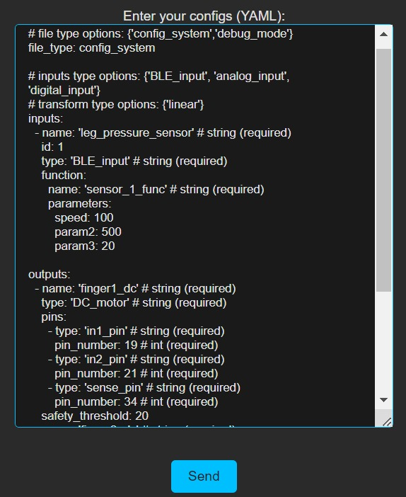

################
Smart Prosthesis
################

**The project simplifies the customization and configuration of smart 
prosthetic hands for diverse user’s needs. Provides a platform that enables 
the customization of smart prosthetic hands.**

System flow
===========

The flow can be divided into two main parts: configuration and operation.

.. figure:: ./images/system_flow.png
   :width: 60%
   :align: center

   Figure 1: System flow.\

Configuration
-------------

.. figure:: ./images/configuration_diagram.png
   :width: 60%
   :align: center

   Figure 1: Configiration flow

The configuration of the hand consists of two main parts:

#. The system either loads from memory or receives from the user a YAML file that specifies the
    system components. This allows for full flexibility in modifying the hand structure in the future.
    The YAML file also associates sensors with their target functionalities (see Functionality).

    After receiving a new configuration file from the user, it will be saved to memory and loaded
    the next time the controller is launched.

#. Functionality - 
    Each sensor corresponds to a specific function that defines the desired behavior of 
    the hand based on the values sensed by the sensor.

    These functions are pre-written by the administrator and can be easily added or modified as needed.
    Each sensor's functionality should be specified in the YAML file.

**note** The configuration of the hand is a one-time operation and does not need to be repeated each time the hand is relaunched.

Operation
----------

.. figure:: ./images/operation_diagram.png
   :width: 60%
   :align: center

   Figure 1: operation flow

After the hand is configured, the system operates with three main flows, managed by three threads:

#. 

